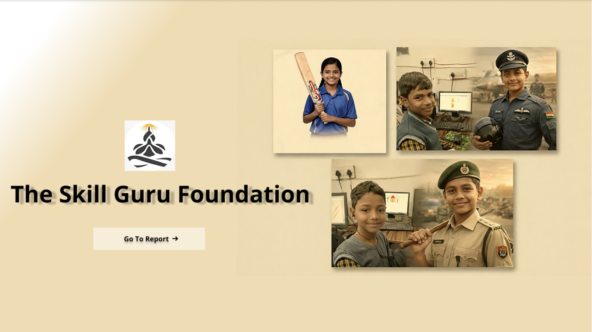

# 📊 Skill Guru Foundation – NGO Data Analysis Project

## 📌 Project Overview
This project focuses on analyzing learner participation, quiz performance, subject impact, difficulty alignment, scheduling effectiveness, and platform reliability for **Skill Guru Foundation**, an NGO working towards skill development through digital quizzes and learning programs.

The analysis aims to uncover **data-driven insights** that help improve learner engagement, content strategy, quiz difficulty design, and scheduling decisions.

---

## 🎯 Objectives
- Analyze overall platform performance  
- Identify high-impact subjects and topics  
- Evaluate quiz difficulty vs learner capability  
- Optimize quiz scheduling (day & time)  
- Assess data reliability and participant mismatch  
- Provide actionable recommendations for improvement  

---

## 🛠️ Tools & Technologies
- **Power BI** – Interactive dashboards & visualizations  
- **Microsoft Excel / CSV** – Data preprocessing  
- **Data Analysis Techniques** – Aggregation, trend analysis, completion metrics  
- **GitHub** – Version control & documentation  

---

## 📈 Key Metrics Analyzed
- Total Participants  
- Completed Users  
- Average Completion Rate  
- Total Quizzes Conducted  
- Subject-wise Participation  
- Topic-wise Completion Rate  
- Difficulty-wise Performance  
- Time & Day-wise Quiz Engagement  
- Participant Mismatch Percentage  

---

## 🖼️ Dashboard Screenshots

### 🔹 Overview Dashboard

---

### 🔹 Page 1 – Overall Performance
**Insights include:**
- Total participants vs completed users  
- Quiz creation trends over time  
- Comparison between Live-Hourly and Challenge quizzes  

---

### 🔹 Page 2 – Subject & Topic Impact
**Insights include:**
- Subjects with highest learner participation  
- Topic-wise participant distribution  
- Topic-wise completion rate comparison  

---

### 🔹 Page 3 – Difficulty Alignment
**Insights include:**
- Learner participation by quiz difficulty  
- Completion rate by difficulty level  
- Quiz duration vs safe completion rate analysis  

---

### 🔹 Page 4 – Scheduling & Data Reliability
**Insights include:**
- Best quiz hours based on completion rate  
- Day-wise quiz performance trends  
- Participant mismatch percentage  
- Mode-wise completion comparison  

---

## 🔍 Key Insights
- Majority of learner participation comes from **Live Hourly quizzes**  
- Certain subjects and topics show **very high completion rates**  
- Presence of “Unknown” categories highlights **data quality improvement opportunities**  
- Evening hours show better learner engagement  
- Very low participant mismatch rate (**0.23%**) indicates strong data reliability  

---

## ✅ Recommendations
- Standardize subject, topic, and difficulty labels  
- Focus more on high-engagement subjects and quiz formats  
- Schedule quizzes during peak engagement hours  
- Reduce “Unknown” category usage through better data validation  
- Balance quiz difficulty to minimize learner drop-offs  

---

---

## 👤 Author
**Anubhav Saxena**  
Aspiring Data Analyst | Power BI | SQL | Python  

🔗 GitHub: https://github.com/Asaxena7124  
🔗 LinkedIn: https://www.linkedin.com/in/anubhavsaxena7124  

---

⭐ If you found this project useful, feel free to star the repository!
